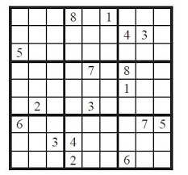
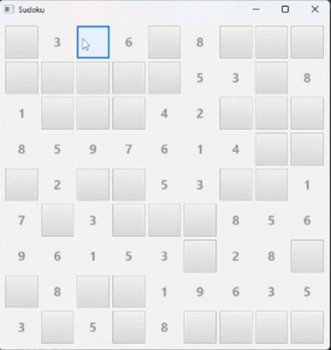

## Sudoku
O famoso jogo japonês, para jogar deve se atentar as regras:
* você deve preencer de 1 a 9
* uma linha ou coluna não pode repetir numeros
* existe uma separação extra de 3x3 que também não deve repetir numeros

exemplo da separação do grid do jogo

# como rodar

clone o repositório e abra um terminal na pasta raiz
digite /mvn javafx:run para rodar o game

# Por dentro do código
O código utiliza um grid do jogo pronto como base e sempre que se abre o jogo, retira 40 números aleatórios, mantendo assim a repetibilidade.

# Imagem do programa
